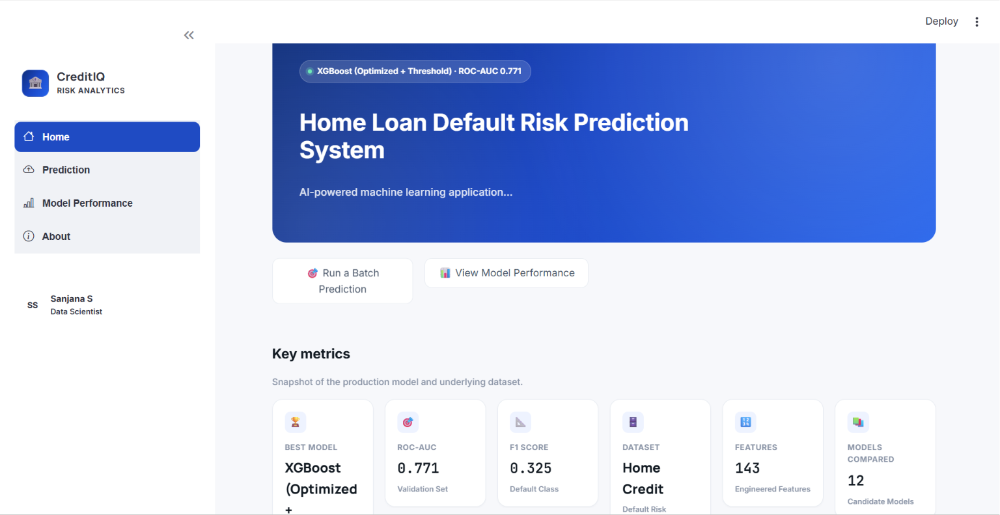
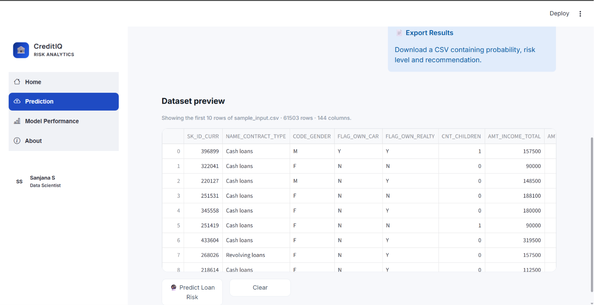
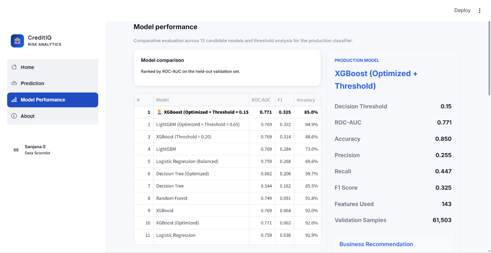
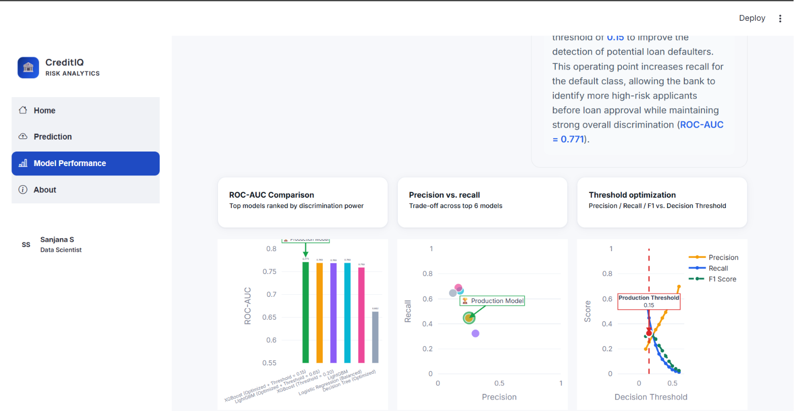

# Home Loan Default Risk Prediction

An end-to-end machine learning project that predicts home loan default risk using applicant data, feature engineering, optimized classification models, and an interactive Streamlit dashboard.

## Live App

Deployment link: add your deployed Streamlit/Railway/Render URL here after publishing.

## Project Overview

Loan default prediction helps financial institutions identify high-risk applicants before loan approval. This project converts borrower, credit, and application-level data into model-ready features, evaluates multiple machine learning models, optimizes the decision threshold, and serves predictions through a clean Streamlit interface.

## Key Features

- Batch default-risk prediction from CSV uploads
- Default probability scoring
- Risk category assignment: Low, Medium, High
- Loan decision recommendation: Approve, Manual Review, Reject
- Model performance dashboard
- ROC-AUC, precision, recall, F1 score, and confusion matrix views
- Downloadable prediction results
- Production model and preprocessing artifacts included

## Tech Stack

- Python 3.11
- Streamlit
- Pandas and NumPy
- Scikit-learn
- XGBoost
- LightGBM
- Plotly, Matplotlib, and Seaborn
- Joblib

## Machine Learning Workflow

1. Data collection
2. Data cleaning
3. Exploratory data analysis
4. Feature engineering
5. Model training
6. Hyperparameter tuning
7. Threshold optimization
8. Model evaluation
9. Batch prediction
10. Streamlit deployment

## Production Model

The production system uses an optimized XGBoost model with threshold tuning.

| Metric | Score |
| --- | ---: |
| ROC-AUC | 0.771 |
| Accuracy | 0.850 |
| Precision | 0.255 |
| Recall | 0.447 |
| F1 Score | 0.325 |
| Decision Threshold | 0.15 |

## Project Structure

```text
home_loan_default_risk_prediction/
├── app.py
├── requirements.txt
├── README.md
├── artifacts/
│   ├── experiment_results/
│   ├── models/
│   └── preprocessors/
├── docs/
├── notebooks/
├── reports/
├── src/
└── visuals/
```

## Screenshots

### Home Dashboard

<p align="center">
  
</p>

<p align="center">
  
</p>

### Prediction Dashboard

<p align="center">
  
</p>

<p align="center">
  
</p>

### Model Performance Dashboard

<p align="center">
  
</p>

<p align="center">
  
</p>

## Installation

Clone the repository:

```bash
git clone https://github.com/KrishnaGupta25/home_loan_default_risk_prediction.git
cd home_loan_default_risk_prediction
```

Create and activate a virtual environment:

```bash
python -m venv venv
```

Windows:

```bash
venv\Scripts\activate
```

macOS/Linux:

```bash
source venv/bin/activate
```

Install dependencies:

```bash
pip install -r requirements.txt
```

Run the Streamlit app:

```bash
streamlit run app.py
```

Open the local URL shown by Streamlit, usually:

```text
http://localhost:8501
```

## Input File Format

Use a CSV file with the same feature structure expected by the trained preprocessing pipeline. A sample file is available at:

```text
notebooks/sample_data/sample_input.csv
```

## Free Deployment Option: Streamlit Community Cloud

Streamlit Community Cloud is the easiest free option for this project.

1. Push this repository to GitHub.
2. Go to https://share.streamlit.io/.
3. Sign in with your GitHub account.
4. Click "New app".
5. Select the repository:

```text
KrishnaGupta25/home_loan_default_risk_prediction
```

6. Select the branch:

```text
main
```

7. Set the main file path:

```text
app.py
```

8. Click "Deploy".
9. Wait for dependencies from `requirements.txt` to install.
10. Copy the public app URL and add it to the "Live App" section above.

## Other Free Deployment Options

### Render

Use Render if you want a simple web service deployment.

Build command:

```bash
pip install -r requirements.txt
```

Start command:

```bash
streamlit run app.py --server.port $PORT --server.address 0.0.0.0
```

### Railway

Use Railway if you prefer GitHub-connected app hosting.

Start command:

```bash
streamlit run app.py --server.port $PORT --server.address 0.0.0.0
```

## Notes

- The repository includes trained model and preprocessing artifacts required by the app.
- Do not commit virtual environment folders such as `venv/` or `venv311/`.
- If model loading warnings appear, they are caused by library version differences between training and runtime. Keep the package versions in `requirements.txt` fixed for best compatibility.

## Author

Krishna

Aspiring Data Scientist

- GitHub: https://github.com/KrishnaGupta25
